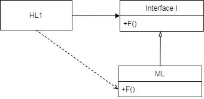

# CleanArchitecture-Book
로버트 C.마틴의 Clean Architecture 책을 정리한 내용입니다. 

## 1부 소개

### 1. 설계와 아키텍쳐란?
이 책의 목적중 하나는 설계(Design)와 아키텍처(Architecture)가 무엇인지를 완전히 정의하는 것이다.
- 아키텍처: 저수준의 세부사항과 분리된 고수준의 무언가를 가리킬때 흔히 사용됨.
- 설계: 저수준의 구조또는 결정사항.
하지만 아키텍트가 실제로 하는일을 보면 이런구분은 무의미하다.
소프트웨어 설계에서 저수준의 세부사항과 고수준의 구조 모두 소프트웨어 전체 설계의 구성요소이다.

> 소프트웨어 아키텍처의 목표는 필요한 시스템을 만들고 유지보수하는 데 투입되는 인력을 최소하는데 있다.

즉, 고객의 요구사항을 만족 시키는것뿐만아니라, 새로운 기능을 출시 할때 개발비용을 최소화하게 설계해야한다.

우리는 바쁘다는 핑계로 '현재의 코드는 나중에 정리하면 돼' 라고 하지만 이미 한번 망가진 코드는 정상적으로 돌아올 수 없다.
개발자의 더 나쁜 거짓말은 '지저분한 코드를 작성하면 단기간에는 빠르게 갈 수 있고, 장기적으로 볼 때만 생산성이 낮아진다'는 견해다.
하지만 진실은 엉망으로 만드면 깔끔하게 유지 할 때보다 항상 더 느리다.

'빨리 가능 유일한 방법은 제대로 가는 것이다.'

### 2. 두 가지 가치에 대한 이야기
소프트웨어 개발자는 두가지 가치를 책임지는데 '행위(behavior)' 와 '구조(structure)' 이다.
아쉽지만 개발자는 두 가지중 하나의 가치에 집중하게 되고, 더 안타까운일은 덜 중요한 가치에 집중하게 된다.

#### 소프트웨어 첫번째 가치: 행위
프로그래머는 고객이 기능 명세서나 요구사항 정의서를 구체화 할 수 있도록 도와준다, 그리고 이러한 요구사항을 토대로 코드를 작성한다.
그리고 문제가 생기면 프로그래머는 문제를 해결한다.
많은 프로그래머들이 이러한 일들이 해야할 일의 전부라고 생각하지만 그들의 생각은 틀렸다.

#### 소프트웨어 두번째 가치: 아키텍처
'소프트웨어(software)'라는 단어는 'soft(부드러운)' + 'ware(제품)'이라는 단어의 합성어이다.
소프트웨어는 이름 그대로 부드러움을 지니도록 만들어졌다. 소프트웨어를 만든 이유는 기계의 행위를 쉽게 변경 할 수 있도록 하기 위해서다.
다시말해 수정사항 혹은 추가요청 기능에 대해 개발이 쉬워야한다. 변경사항을 적용하는데 드는 어려움은 변경되는 범위(scope)에 비례해야한다.
변경사항의 형태(shape)와는 관련이 없다.

#### 더높은 가치: 기능 Vs. 아키텍처
어느것이 중요한가? 소프트웨어 시스템이 잘 동작하는게 중요한가? 소프트웨어 시스템을 더 쉽게 변경 할 수 있도록 하는것이 중요한가?
고객의 입장에서는 시스템이 잘 동작하는게 중요할 것 이다. 그럼 소프트웨어 개발자 입장에서도 많은 개발자들이 고객의 생각에 동조 할것 이다.
하지만 틀린 생각이다.

Ex) 극단적인 사례
완벽하게 돌아가지만 변경이 불가한 시스템 Vs. 동작은 안하지만 변경이 쉬운 시스템
완벽하게 돌아가지만 변경이 불가한 시스템: 변경 요구사항이 발생하면 수정이 불가 하므로 더이상 쓸모없는 시스템이 된다.
동작은 안하지만 변경이 쉬운 시스템: 동작 가능하게 변경할 수 있다.

#### 아이젠하워 매트릭스

> 내겐 두가지 유형의 문제가 있습니다. 하나는 긴급하며, 다른 하나는 중요합니다. 
> 긴급한 문제는 중요하지 않으며, 중요한 문제는 절대 긴급하지 않습니다.

이 격언에는 긴급한 문제가 중요한 문제일 경우는 드물고, 중요한문제가 몹시 긴급한 경우는 거의 없다는 사실이 포함 되어 있다.

소프트웨어 첫 번째 가치인 행위는 긴급하지만 매번 높은 중요도를 가지는것으 아니다.
소프트웨어 두 번째 가치인 아키텍처는 중요하지만 즉각전인 긴급성을 필요로 하는 경우는 (절대)없다.
당연한 이야기지만 긴급하면서도 중요할 수 있고 반대로 긴급하지 않고 중요하지 않을수도 있다.

 
 우선 순위를 매겨보면
 1. 긴급하고 중요한
 2. 긴급하지는 않지만 중요한
 3. 긴급하지만 중요하지 않은
 4. 긴급하지도 중요하지도 않은
 
 여기서 중요한일은 아키텍쳐이기에 우선순위에서 가장 높은 두순위를 차지하는 반면 행위는 첫번째 세번째 우선순위를 차지하고 있다
 하지만 고객의 입장에서는 아키텍쳐보다 행위에 더 중요하다는 가치를 두고 있기에 개발자로서는 아키텍쳐의 중요성을 고객에 설득할 의무가 있다. 
 (책에서는 싸움판에 뛰어들어서 이겨야한다라고 표현하고 있다)

## 2부 벽돌부터 시작하기: 프로그래밍 패러다임

### 3. 패러다임 개요
1958년부터 1968년까지 10년이라는 시간동안 `구조적프로그래밍` `객체지향프로그래밍` `함수형프로그래밍` 만들어졌다. 
그후로 새롭게 등장한 패러다임은 현재까진 없다.

### 4. 구조적 프로그래밍
구조적 프로그래밍은 제어흐름의 직접적인 전환에 대해 규칙을 부과한다.

### 5. 객체 지향 프로그래밍
객체지향(Object Oriented, 이하 OO)이랑 무엇인가? 어쩌면 개발자로 살면서 가장 많이 듣는말이지만 딱히 뭐라고 속시원하게 말 할 수 없는 질문중에 하나인것 같다.
 
 '데이터와 함수의 조합'
 
 '실제 세계를 모델링하는 새로운 방법'
 
 객체지향을 이야기하면 항상 함께 이야기하는게 '캡슐화', '상속', '다형성'이다. 이 세가지 개념에 대해서 생각해보자.
 
#### 캡슐화
캡슐화를 언급하는 이유는 데이터와 함수를 효과적으로 캡슐화하는 방법을 OO언에서 제공하기 때문이다.
OO언어 에서는 각각 클래스의 private 멤버 데이터를 public 멤버함수로 표현한다.
사실 이러한 개념은 OO언에 국한된것은 아니다. C언어에서도 완벽한 캡슐화 가능하다.
C에서 데이터구조와 함수를 헤더파일에 선언하고, 구현파일에서 이들을 구현했다. 그리고 실제 프로그램 사용자는 구현파일에 작성된 항목에 대해서는 어떤방법으로도 접근할 수 없다.

C++이 등장하면서 C가 제공하던 완전한 캡슐화는 깨져버렸다. 멤버변수를 해당클래스의 헤더파일에 선언할 것을 요구했고, 헤더파일을 사용하는 측면에서는 멤버변수를 알 수 있게 되었다.
public, private, protected 식별자가 도입되면서 어느정도 보완되었지만 임시적인 조치일뿐이다.

이때문에 OO언어가 강력한 캡슐화를 가진다기 힘들다 실제로도 많은 언어들이 강제하지 않고 있다. 

#### 상속?
OO언어에서 제공하는 상속은 단순히 어떤 변수와 함수를 하나의 유효범위로 묶어서 재정의하는일에 불과하다.

#### 다형성

#### 다형성이 가진 힘

#### 의존성 역전

그림에서 HL1모듈은 ML모듈의 F() 함수를 호출한다. 우리가 사용하는 소스코드에서는 Interface I를 F()함수를 호출한다. 해당 인터페이스는 런타임에서는 존재 않고
단순히 ML모듈의 함수 F()를 호출 할 뿐이다.

하지만 ML과 I 인터페이스 사이의 소스코드 의존성(상속관계)이 제어흐름과는 반대인점을 주목하자. 이는 의존성 역전 (dependency inversion)이라고 부른다.
OO언어가 다형성을 안전하고 편리하게 제공한다는 사실은 소스코드 의존성을 어디에서든 역전시킬수 있는 뜻 이기도하다.

결론적으로 OO란 무엇인가에 질문에 많은 답변이 있었지만 소프웨어 아키텍트 관점에서는 OO란 다형성을 이용하여 전체 시스템의 모든소스 코드 의존성에 대한 절대적인 제어권한을 
획득할 수 있는 능력이다. 이를 통해 고수준의 정책을 포함하는 모듈은 저수준 모듈에 대해 독립성을 보장 할 수 있다. 

### 6. 함수형 프로그래밍

## 3부 설계원칙

### 7. SRP: 단일 책임 원칙

### 8. OCP: 개방-패쇄 원칙

### 9. LSP: 리스코프 치환 원칙

### 10. ISP: 인터페이스 분리 원칙

### 11. DIP: 의존성 역전 원칙

## 4부 컴포넌트 원칙

### 12. 컴포넌트

### 13. 컴포넌트 응집도

### 14. 컴포넌트 결합

## 5부 아키텍쳐

### 15. 아키텍쳐란?

### 16. 독립성

### 17. 경계: 선 긋기

### 18. 경계 해부학

### 19. 정책과 수준

### 20. 업무 규칙

### 21. 소리치는 아키텍쳐

### 22. 클린 아키텍처 

### 23. 프렌젠터와 험블 객체

### 24. 부분적 경계

### 25. 계층과 경계

### 26. 메인(Main) 컴포넌트

### 27. '크고 작은 모든' 서비스들

### 28. 테스트 경계

### 29. 클린 임베디드 아키텍쳐

## 6부 세부사항

### 30. 데이터베이스는 세부사항이다

### 31. 웹은 세부사항이다

### 32. 프레임워크는 세부사항이다
 

